# Malaria Modeling Faculty Enrichment Program 2022

### Technical track (EMOD)

Example scripts for the [weekly lessons](https://faculty-enrich-2022.netlify.app/lessons/) of the faculty enrichment
program 2022.

**Prerequisites**: successful [installation]((https://faculty-enrich-2022.netlify.app/modules/install-emod/)) of EMOD and dtk
and [cloned repository](https://docs.github.com/en/repositories/creating-and-managing-repositories/cloning-a-repository) to local computer, ideally under _/<.username>/Documents/faculty-enrich-2022-examples_.

#### Weekly example exercises

- [Go to Week 1](#week1)    _(MR: ready for testing)_
- [Go to Week 2](#week2)    _(MR: ready for testing)_
- [Go to Week 3](#week3)    _(MR: ready for testing)_
- [Go to Week 4](#week4)    _(MR: ready for testing)_
- Week 5: no technical track
- [Go to Week 6](#week6)    _(TH: setup in progress)_
- [Go to Week 7](#week7)    _(BT)_
- [Go to Week 8](#week8)    _(MR)_
- [Go to Week 9](#week9)    _(JG&? )_
- Week 10: no technical track
- [Go to Week 11](#week11)    _(BT)_
- [Go to Week 12](#week12)    _(TH)_
- [Go to Week 13](#week13)    _(tbd)_
- [Go to Week 14](#week14)    _(BT)_

__Table 1: Overview of scripts used throughout the course__

|Script |Description | 
|-------|------------|
|analyzer_collection.py | collection of different analyzers used| 
|analyze_exampleSim_wX.py |the main analyzer script which changes each week (w1, w2,...w5) | 
|generate_input_files.py |the default script for creating demographics and climate which needs to run only once or when substantial changes are made | 
|plot_exampleSim.py, plot_exampleSim.R | plotting scripts outside of analyzerin python or R |
|run_exampleSim.py       |the main simulation script which will be expanded and modified throughout the lessons | 
|run_exampleBurnin_w6.py | first simulation script for week 6 where simulation is splitted into 2 runs (Burnin)  | 
|run_examplePickup_w6.py | second simulation script for week 6 where simulation is splitted into 2 runs (Pickup)   | 
|simtools.ini |  Configuration file for main directories required to run simulations (1 single file need in same directory where simulation or analyser script is run) | 


## Week 1: Overview of EMOD <a name="week1"></a>

[Lesson Week 1](https://faculty-enrich-2022.netlify.app/lessons/week-1/)

EMOD How To's:
- Update _simtools.ini_
- Define _exp_name_ and identify _expt_id_

### Instructions

<details><summary><span>Click to expand</span></summary>
<p>

- Adjust paths in `simtools.ini` by replacing `<USERNAME>` with your username in path
- Run simulation via `python run_exampleSim.py`
- Wait simulation to finish (~5 minutes)
  - Note, when running locally, the console might return an <span style="color:#ff6666">psutil.AccessDenied text</span>
    error, however the simulation can still successfully run and finish.
  - If there are problems with running locally, you can peek into [Week 6](#week6) on how to change `SetupParser` to run on _COMPS_ (requires login)!  
- Go to the experiment folder to notice the generated simulation experiment named 'username_FE_2022_example_w1___2022_04_29_02_14_46_106520' The last part after the '___' is the experiment id and changes with each simulation.
- Update expt_id in `analyze_exampleSim_w1.py` Line 14 (copy number sequence after ___, also printed to console)
- Run analyzer via `python analyze_exampleSim_w1.py`
- Inspect `simulation_outputs` to see generated simulation results (csv files)
- Done!

<details><summary><span>Check results</span></summary>
<p>

Terminal output after running run_exampleSim.py
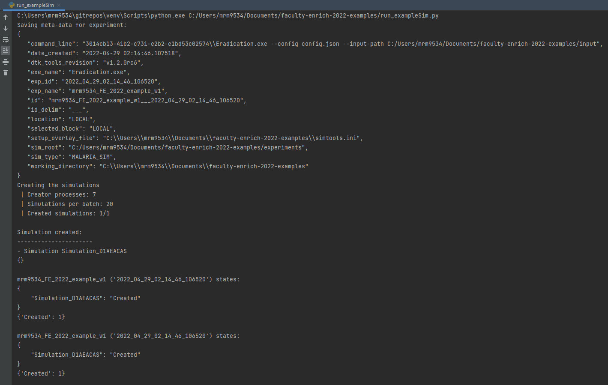

Once finished
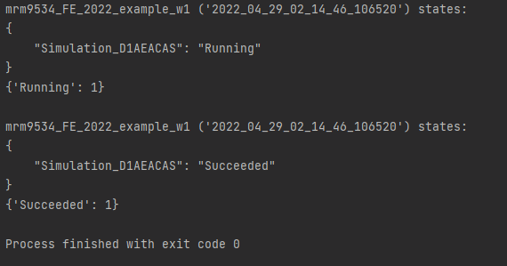

Generated experiment files 
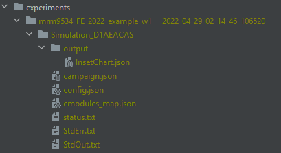

Terminal output after running analyze_exampleSim_w1.py


Generated simulation output files 


**All_Age_Monthly_Cases.csv** shows selected monitored malaria outcomes for the total population in the simulation aggregated per month for the simulation duration, in this example 1 year.
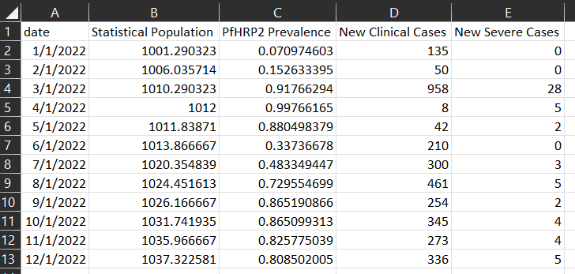


</p>
</details>

</p>
</details>

## Week 2: Basic building blocks of EMOD <a name="week2"></a>

[Lesson Week 2](https://faculty-enrich-2022.netlify.app/lessons/week-2/)

EMOD How To's:

- [Update config parameters](https://faculty-enrich-2022.netlify.app/modules/emod-how-to/emod-how-to/#update-config-parameters)
- [Create a demographics file](https://faculty-enrich-2022.netlify.app/modules/emod-how-to/emod-how-to/#create-a-demographics-file)
- [Create climate files](https://faculty-enrich-2022.netlify.app/modules/emod-how-to/emod-how-to/#create-climate-files)
- [Add summary reports](https://faculty-enrich-2022.netlify.app/modules/emod-how-to/emod-how-to/#add-summary-reports) (annual)

### Instructions

<details><summary><span>Click here to expand</span></summary>
<p>

- Create _demographics_ and _climate_ files via `generate_input_files.py`
- Update default parameters in `python run_exampleSim.py`:

    ```py
    cb.update_params({
        'Demographics_Filenames': [os.path.join('Ghana', 'Ghana_2.5arcmin_demographics.json')],
        "Air_Temperature_Filename": os.path.join('Ghana', 'Ghana_30arcsec_air_temperature_daily.bin'),
        "Land_Temperature_Filename": os.path.join('Ghana', 'Ghana_30arcsec_air_temperature_daily.bin'),
        "Rainfall_Filename": os.path.join('Ghana', 'Ghana_30arcsec_rainfall_daily.bin'),
        "Relative_Humidity_Filename": os.path.join('Ghana', 'Ghana_30arcsec_relative_humidity_daily.bin'),
        "Age_Initialization_Distribution_Type": 'DISTRIBUTION_COMPLEX'
    })
    ```
- Add custom reporter with annual summary for different age groups
    - add `add_summary_report` (see EMOD How To's) or below
      ```py
      from malaria.reports.MalariaReport import add_summary_report
      add_summary_report(cb, start=1, interval=365,
                       age_bins=[0.25, 2, 5, 10, 15, 20, 100, 120], 
                       description='Annual_Agebin')
      ```
- Increase simulation duration from 1 to 3 years by modifying DTKConfigBuilder as below:
  ```py 
    years = 3
    cb = DTKConfigBuilder.from_defaults('MALARIA_SIM', Simulation_Duration=years*365)
  ```

- Change _exp_name_  for week 2 `f'{user}_FE_2022_example_w2'`
- Run simulation as learned in Week 1 and wait for simulation to finish (~5 minutes)
    - Note, if there are problems with running locally, you can peek into [Week 6](#week6) on how to change `SetupParser` to run on _COMPS_ (requires login)!
- Run analyzer script for Week 2 `analyze_exampleSim_w2.py` (don't forget to update expt_id!)
- Inspect `simulation_outputs` to see additional generated plot
    - Optional: rerun analyzer with plot for week 1 and compare.
    - _Note that EMOD is a stochastic model and any changes at low population size and few repetitions might be at
      random and not necessarily due to the parameter change!_
- Run additional simulations with different durations, population sizes or for different agebins _(Tip: change exp_name
  to keep track of your simulations)_
  ```py 
  # Example of how to change additional parameters from the config file
  cb.update_params({
        'x_Base_Population': 1,
        'x_Birth': 1,
        'x_Temporary_Larval_Habitat': 1
    })
  ```
- Again, inspect the simulation outputs and compare them against each other:
    - How do the outcomes change?
    - What do you recognize about running time?

<details><summary><span>Check results</span></summary>
<p>

Generated simulation files  
   


Generated plot from InsetChart  
  

Generated plot from annual summmary report  
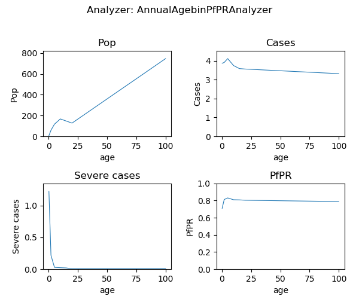  


View
suggested [solution script for week 2](https://github.com/numalariamodeling/faculty-enrich-2022-examples/blob/main/Solution_scripts/run_exampleSim_w2.py)

</p>
</details>

</p>
</details>

## Week 3: Interventions in EMOD <a name="week3"></a>

[Lesson Week 3](https://faculty-enrich-2022.netlify.app/lessons/week-3/)

EMOD How To's:

- [Add case management](https://faculty-enrich-2022.netlify.app/modules/emod-how-to/emod-how-to/#add-case-management)
- [Add ITN](https://faculty-enrich-2022.netlify.app/modules/emod-how-to/emod-how-to/#add-itn)
- [Add IRS](https://faculty-enrich-2022.netlify.app/modules/emod-how-to/emod-how-to/#add-irs)
- [Add larvicides](https://faculty-enrich-2022.netlify.app/modules/emod-how-to/emod-how-to/#add-larvicides)
- [Add drug campaigns](https://faculty-enrich-2022.netlify.app/modules/emod-how-to/emod-how-to/#add-drug-campaigns)
- [Add summary reports](https://faculty-enrich-2022.netlify.app/modules/emod-how-to/emod-how-to/#add-summary-reports) (monthly)
- [Add event reporters](https://faculty-enrich-2022.netlify.app/modules/emod-how-to/emod-how-to/#event-reporting)
- [Using the model builder to set up multi-simulation experiments](https://faculty-enrich-2022.netlify.app/modules/emod-how-to/emod-how-to/#using-the-model-builder-to-set-up-multi-simulation-experiments)

### Instructions

#### PART I - customization of the simulation, add interventions and reports

<details><summary><span>Click here to expand</span></summary>
<p>

- Add multiple interventions and create campaign files (see EMOD How To's) or below. For each add code chunk into the
  exampleSim simulation script, and import the corresponding modules for the selected interventions.
    - Interventions to select:
        - <details><summary><span style="color: blue";">add_health_seeking </span></summary>
            <p>

           ```py
            from malaria.interventions.health_seeking import add_health_seeking
            add_health_seeking(cb, start_day=0,
                               targets=[{'trigger': 'NewClinicalCase', 'coverage': 0.7,
                                         'agemin': 0, 'agemax': 5, 'seek': 1, 'rate': 0.3},
                                        {'trigger': 'NewClinicalCase', 'coverage': 0.5,
                                         'agemin': 5, 'agemax': 100, 'seek': 1, 'rate': 0.3},
                                        {'trigger': 'NewSevereCase', 'coverage': 0.85,
                                         'agemin': 0, 'agemax': 100, 'seek': 1, 'rate': 0.5}],
                               drug=['Artemether', 'Lumefantrine'])
            ```
             </p>
             </details>
        - <details><summary><span style="color: blue";">add_drug_campaign </span></summary>
            <p>

           ```py
            from malaria.interventions.malaria_drug_campaigns import add_drug_campaign
            add_drug_campaign(cb, campaign_type='SMC', drug_code='SPA',
                              coverage=0.8,
                              start_days=[366],
                              repetitions=4,
                              tsteps_btwn_repetitions=30,
                              target_group={'agemin': 0.25, 'agemax': 5},
                              receiving_drugs_event_name='Received_SMC')
           ```
             </p>
             </details>
        - <details><summary><span style="color: blue";">add_ITN or add_ITN_age_season </span></summary>
            <p>

           ```py
            from dtk.interventions.itn_age_season import add_ITN_age_season
            add_ITN_age_season(cb, start=366,
                               demographic_coverage=0.8,
                               killing_config={
                                   "Initial_Effect": 0.520249973,  # LLIN Burkina
                                   "Decay_Time_Constant": 1460,
                                   "class": "WaningEffectExponential"},
                               blocking_config={
                                   "Initial_Effect": 0.53,
                                   "Decay_Time_Constant": 730,
                                   "class": "WaningEffectExponential"},
                               discard_times={"Expiration_Period_Distribution": "DUAL_EXPONENTIAL_DISTRIBUTION",
                                              "Expiration_Period_Proportion_1": 0.9,
                                              "Expiration_Period_Mean_1": 365 * 1.7,  # Burkina 1.7
                                              "Expiration_Period_Mean_2": 3650},
                               age_dependence={'Times': [0, 100],
                                               'Values': [0.9, 0.9]},
                               duration=-1, birth_triggered=False
                               )
           ```
           ```py                    
            ### Or alternatiively 
            from dtk.interventions.itn import add_ITN
            add_ITN(cb,
                    start=366,  # starts on first day of second year
                    coverage_by_ages=[
                        {"coverage": 1, "min": 0, "max": 10},  # Highest coverage for 0-10 years old
                        {"coverage": 0.75, "min": 10, "max": 50}, # 25% lower than for children for 10-50 years old
                        {"coverage":  0.6, "min": 50, "max": 125} # 40% lower than for children for everyone else
                    ],
                    repetitions=5,  # ITN will be distributed 5 times
                    tsteps_btwn_repetitions=365 * 3  # three years between ITN distributions
                    )
        
           ```
            </p>
            </details>
        - <details><summary><span style="color: blue";">add_IRS </span></summary>
            <p>

           ```py
            from dtk.interventions.irs import add_IRS
            add_IRS(cb, start=366,
                    coverage_by_ages=[{"coverage": 0.8, "min": 0, "max": 100}],
                    killing_config={
                        "class": "WaningEffectBoxExponential",
                        "Box_Duration": 180,  # based on PMI data from Burkina
                        "Decay_Time_Constant": 90,  # Sumishield from Benin
                        "Initial_Effect": 0.7},
                    )
           ```
            </p>
            </details>
        - <details><summary><span style="color: blue";">add_larvicides </span></summary>
            <p>

           ```py
            from dtk.interventions.novel_vector_control import add_larvicides
            add_larvicides(cb, start_day=0, 
                           habitat_target='CONSTANT',  
                           killing_initial=0.6,        
                           killing_decay=150          
                           )
           ```
            </p>
            </details>          
        - <details><summary><span style="color: blue";">add_vaccine </span></summary>
            <p>

           ```py
            from malaria.interventions.malaria_drug_campaigns import add_drug_campaign
            add_vaccine(cb,
                        vaccine_type='RTSS',
                        vaccine_params={"Waning_Config":
                                            {"Initial_Effect": 0.8,
                                             "Decay_Time_Constant": 592.4066512,
                                             "class": 'WaningEffectExponential'}},
                        start_days=[366],
                        coverage=0.2,
                        repetitions=1,
                        tsteps_btwn_repetitions=-1,
                        target_group={'agemin': 274, 'agemax': 275})  # children 9 months of age
           ```
            </p>
            </details>
- To keep track of the campaign events in the simulations, add `event_list = []` and expand as needed
  via  `event_list = event_list + [<new_event_name>]`
    - Event
      names:  `'Received_Treatment', 'Received_Severe_Treatment','Received_IRS', 'Received_SMC', 'Received_Vaccine' `
      and either 'Bednet_Got_New_One', 'Bednet_Using', 'Bednet_Discarded' for `add_ITN_age_season`  or 'Received_ITN' for `add_ITN`
- Next, add additional custom reporters to monitor events happening in the simulation
    - Report_Event_Recorder and Report_Event_Counter:
      ``` py
      from malaria.reports.MalariaReport import add_event_counter_report
       cb.update_params({
            "Report_Event_Recorder": 1,
            "Report_Event_Recorder_Individual_Properties": [],
            "Report_Event_Recorder_Ignore_Events_In_List": 0,
            "Report_Event_Recorder_Events": event_list,   
            'Custom_Individual_Events': event_list   
        })
        # Report_Event_Counter
        add_event_counter_report(cb, event_trigger_list=event_list, start=0, duration=10000)
      ```
- Change _exp_name_ for week 3 `f'{user}_FE_2022_example_w3a'`
- Now, run the simulation and wait for it to finish (~5 minutes)
- While simulations runs, familarize yourself with the generated campaign file, does it include all interventions
  specified?
    - The `campaign.json` file is located in your experiment simulation folder.
- Run analyzer script for Week 3 (`analyze_exampleSim_w3a.py`) (don't forget to update _expt_id_!)
- Inspect the different results generated in `simulation_outputs`.
    - Are all intervention events happening as expected?
    - Parameters changes you can explore with further simulations:
        - disable and enable some intervention by changing coverage
            - does malaria transmission get interrupted if you set all to 1?
        - age group of receiving an intervention
        - efficacy or start date of an intervention

<details><summary><span>Check results</span></summary>
<p>

Raw output files in the experiment folder under outputs.
  


**ReportEventCounter** with campaign events, aggregated for total population. Most Interventions were set to start after day
366, hence there are 365 zeros in the `"Data": [0, 0, ...]`
  
_Tip: Notepad ++ offers helpful json plugins._

**ReportEventRecorder** with campaign events, for each individual in the population. Some individuals get multiple
interventions, some none and so on - age is given in days.
  
_Tip: When running simulations with large populations, this csv file can get very large and should be disabled, while
for testing it is very useful._

Generated results after running analyzer in simulation_outputs/<.exp_name>:
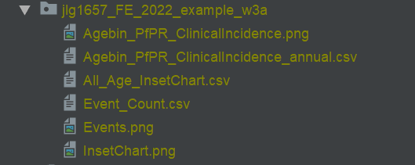   

Aggregated transmission report (daily)  
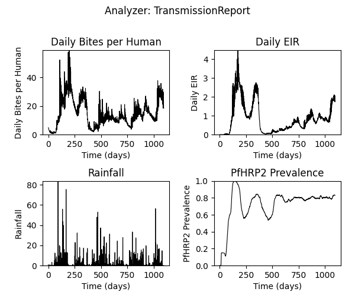  

Aggregated transmission report (monthly)  
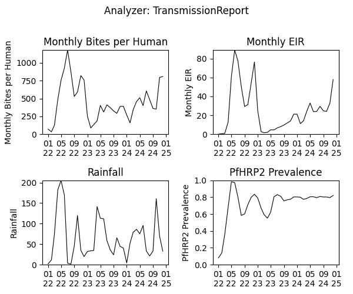  

Aggregated transmission report (annually)  
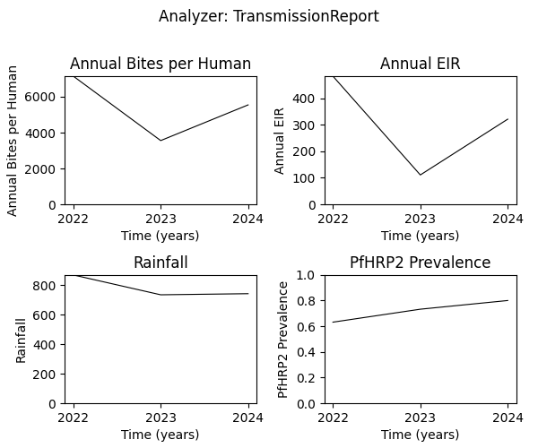  

Aggregated event report (ITN, Bed nets)
  

Aggregated event report (other campaigns)  
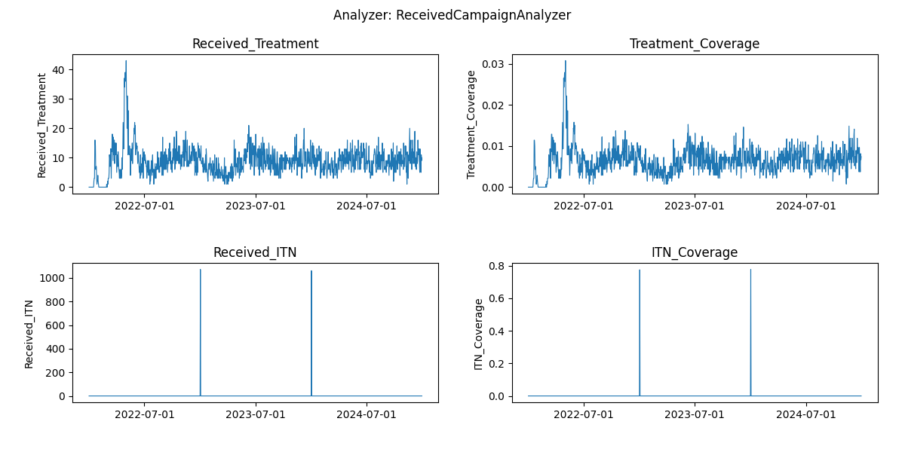  


View
suggested [solution script for week 3 (a)](https://github.com/numalariamodeling/faculty-enrich-2022-examples/blob/main/Solution_scripts/run_exampleSim_w3a.py)


</p>
</details>

</p>
</details>

#### PART II - multi-simulation experiment using ModBuilder

<details><summary><span>Click here to expand</span></summary>
<p>

- Further modify the simulation script to run multiple simulations using the detailed steps below
    - import modules  `from simtools.ModBuilder import ModBuilder, ModFn`
    - specify number of seeds i.e. `numseeds = 3` (the more seeds the more single simulations run and it takes longer
      until whole simulation experiment finishes)
    - modify `run_sim_args` as follows:
      ```py
      expt_name =  f'{user}_FE_2022_example_w3b'
      run_sim_args = {
          'exp_name': expt_name,
          'config_builder': cb,
          'exp_builder' : builder
      }
      ```
    - add ModBuilder
      ```py
      builder = ModBuilder.from_list([[ModFn(DTKConfigBuilder.set_param, 'Run_Number', x)
                                      ]
                                      for x in range(numseeds)
                                      ])
      ```
- modify and extend ModBuilder to allow running different parameter sweeps
    ```py
    builder = ModBuilder.from_list([[ModFn(case_management, cm_cov_U5),
                                     ModFn(smc_intervention, coverage_level=smc_cov), 
                                     ModFn(DTKConfigBuilder.set_param, 'Run_Number', x)
                                    ]
                                    for cm_cov_U5 in [0.4, 0.6] 
                                    for smc_cov in [0, 0.6] 
                                    for x in range(numseeds)
                                    ])
    ```

- In order for case management and SMC campaigns to take different coverage parameters as specified above, they need to
  be changed into a function that takes cb as input as shows below:
    - wrap `add_health_seeking` into `case_management` and others into functions:
      
        - <details><summary><span style="color: blue";">case_management </span></summary>
           <p>
          
           ```py
            def case_management(cb, cm_cov_U5, cm_cov_adults=0.5):
                add_health_seeking(cb, start_day=0,
                                   targets=[{'trigger': 'NewClinicalCase', 'coverage': 0.7,
                                             'agemin': 0, 'agemax': 5, 'seek': 1, 'rate': 0.3},
                                            {'trigger': 'NewClinicalCase', 'coverage': 0.5,
                                             'agemin': 5, 'agemax': 100, 'seek': 1, 'rate': 0.3},
                                            {'trigger': 'NewSevereCase', 'coverage': 0.85,
                                             'agemin': 0, 'agemax': 100, 'seek': 1, 'rate': 0.5}],
                                   drug=['Artemether', 'Lumefantrine'])
            
                return {'cm_cov_U5': cm_cov_U5,
                        'cm_cov_adults': cm_cov_adults}
            ```
             </p>
             </details>
        - <details><summary><span style="color: blue";">smc_intervention </span></summary>
            <p>

           ```py
            def smc_intervention(cb, coverage_level, day=366, cycles=4):
                add_drug_campaign(cb, campaign_type='SMC', drug_code='SPA',
                                  coverage=coverage_level,
                                  start_days=[day],
                                  repetitions=cycles,
                                  tsteps_btwn_repetitions=30,
                                  target_group={'agemin': 0.25, 'agemax': 5},
                                  receiving_drugs_event_name='Received_SMC')
            
                return {'smc_start': day,
                        'smc_coverage': coverage_level}
 
           ```
          
             </p>
             </details>
        - <details><summary><span style="color: blue";">itn_intervention </span></summary>
            <p>

           ```py  
            def itn_intervention(cb, coverage_level, day=366):
                add_ITN_age_season(cb, start=day,
                                   demographic_coverage=coverage_level,
                                   killing_config={
                                       "Initial_Effect": 0.520249973,  # LLIN Burkina
                                       "Decay_Time_Constant": 1460,
                                       "class": "WaningEffectExponential"},
                                   blocking_config={
                                       "Initial_Effect": 0.53,
                                       "Decay_Time_Constant": 730,
                                       "class": "WaningEffectExponential"},
                                   discard_times={"Expiration_Period_Distribution": "DUAL_EXPONENTIAL_DISTRIBUTION",
                                                  "Expiration_Period_Proportion_1": 0.9,
                                                  "Expiration_Period_Mean_1": 365 * 1.7,  # Burkina 1.7
                                                  "Expiration_Period_Mean_2": 3650},
                                   age_dependence={'Times': [0, 100],
                                                   'Values': [0.9, 0.9]},
                                   duration=-1, birth_triggered=False
                                   )
          event_list = event_list + ['Bednet_Got_New_One', 'Bednet_Using', 'Bednet_Discarded']

           ```
           ```py                    
            ### Or alternatiively 
            def itn_intervention(cb, coverage_level, day=366):
                add_ITN(cb,
                        start=366,  # starts on first day of second year
                        coverage_by_ages=[
                            {"coverage": coverage_level, "min": 0, "max": 10},  # Highest coverage for 0-10 years old
                            {"coverage": coverage_level * 0.75, "min": 10, "max": 50}, # 25% lower than for children for 10-50 years old
                            {"coverage": coverage_level * 0.6, "min": 50, "max": 125} # 40% lower than for children for everyone else
                        ],
                        repetitions=5,  # ITN will be distributed 5 times
                        tsteps_btwn_repetitions=365 * 3  # three years between ITN distributions
                        )
            
                return {'itn_start': day,
                        'itn_coverage': coverage_level}
           event_list = event_list + ['Received_ITN']
           ```
            </p>
            </details>
          
        - <details><summary><span style="color: blue";">irs_intervention </span></summary>
            <p>

           ```py
            # IRS, start after 1 year - single campaign
            def irs_intervention(cb, coverage_level, day=366):
                add_IRS(cb, start=day,
                        coverage_by_ages=[{"coverage": coverage_level, "min": 0, "max": 100}],
                        killing_config={
                            "class": "WaningEffectBoxExponential",
                            "Box_Duration": 180,  # based on PMI data from Burkina
                            "Decay_Time_Constant": 90,  # Sumishield from Benin
                            "Initial_Effect": 0.7},
                        )
            
                return {'irs_start': day,
                        'irs_coverage': coverage_level}

           ```
            </p>
            </details>
        - <details><summary><span style="color: blue";">rtss_intervention </span></summary>
            <p>

           ```py
            # malaria vaccine (RTS,S), no booster start after 1 year
            def rtss_intervention(cb, coverage_level, day=366, agemin=274, agemax=275, initial_efficacy=0.8):
                add_vaccine(cb,
                            vaccine_type='RTSS',
                            vaccine_params={"Waning_Config":
                                                {"Initial_Effect": initial_efficacy,
                                                 "Decay_Time_Constant": 592.4066512,
                                                 "class": 'WaningEffectExponential'}},
                            start_days=[day],
                            coverage=coverage_level,
                            repetitions=1,
                            tsteps_btwn_repetitions=-1,
                            target_group={'agemin': agemin, 'agemax': agemax})  # children 9 months of age
            
                return {'rtss_start': day,
                        'rtss_coverage': coverage_level,
                        'rtss_initial_effect': initial_efficacy}
           ```
            </p>
            </details>
    
- Now change _exp_name_  to `f'{user}_FE_2022_example_w3b'` and the simulation is ready to go!
- Run simulation and wait for simulation to finish (~10 minutes)
    - While waiting, check out the generated experiment folder, that now includes many more subfolders for each of the single simulations.
    Open two campaign files and compare, do you find the difference? (If there is none, these might be two different run numbers for same simulation)
      _(Tip: Many text editors allow side by side comparison of two scripts, automatically highlighting differences)_
- Run second analyzer script for Week 3 (`analyze_exampleSim_w3b.py`) (don't forget to update _expt_id_ : ))
  - While having the analyzer script open, also check that all the relevant sweep variables are included. 
    Note that the sweep_variables need to change according to the `ModBuilder` and custom functions used to define scenarios, depending on which ones uniquely define each simulation and are required in the analysis.
  ```py
      sweep_variables = ['cm_cov_U5', 'smc_coverage', 'itn_coverage', 'irs_coverage', 'rtss_coverage', 'Run_Number']
  ```
- Inspect `simulation_outputs` and compare against outputs from the previous week.
- Change intervention parameters in the `ModBuilder` and repeat the simulation process to become more familar with the process.

<details><summary><span>Check results</span></summary>
<p>

The generated result figures include separate lines. 
The Run_Numbers were aggregated using the mean and the intervention coverage levels are used as additional 
grouping variables when aggregating simulation outputs.
An additional variable 'unique_sweep' was generaetd to simplify automated plotting for different sweep variabels (the parameters defined in `ModBuilder`)
In the example below 'unique_sweep' is in the order of cm, smc, itn, irs, and rtss (rtss not included below).


Aggregated malaria outcomes by agebin for no SMC (blue) compared to SMC (orange).
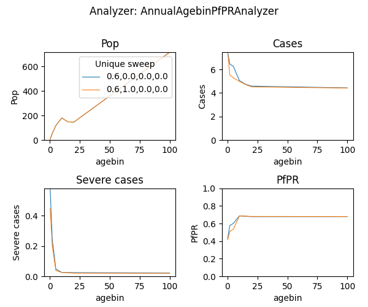
__Fig: Agebin_PfPR_ClinicalIncidence__


All age monthly cases showing no SMC (blue) compared to SMC (orange).
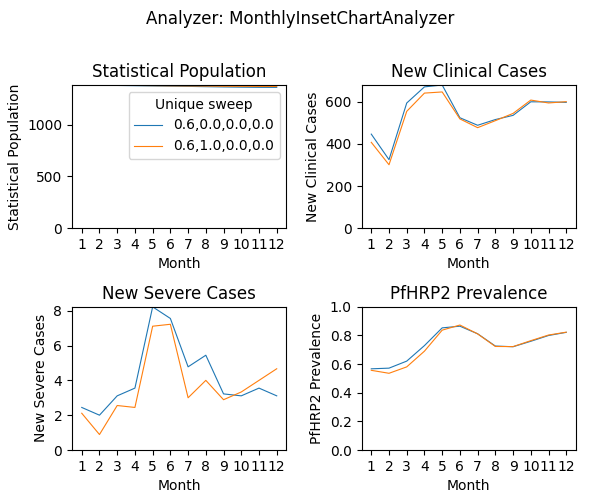
__Fig: All_Age_Monthly_Cases__


Monthly transmission report showing no SMC (blue) compared to SMC (orange).
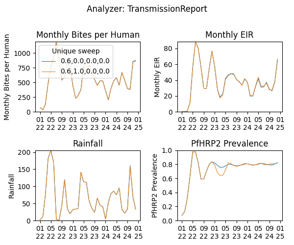
__Fig: TransmissionReport_monthly (SMC)__

Note, if too many parameters changed at once without clear labelling, the results can become difficult to interpret!
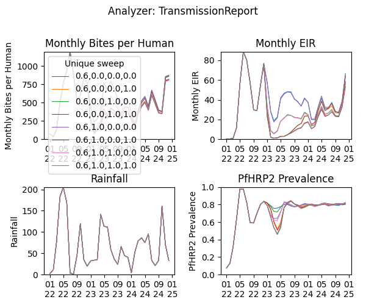
__Fig: TransmissionReport_monthly (multiple interventions)__

View
suggested [solution script for week 3 (b)](https://github.com/numalariamodeling/faculty-enrich-2022-examples/blob/main/Solution_scripts/run_exampleSim_w3b.py)

</p>
</details>

</p>
</details>

## Week 4: Analyzers and plotters <a name="week4"></a>

[Lesson Week 4](https://faculty-enrich-2022.netlify.app/lessons/week-4/)

EMOD How To's:

- [Add summary reports](https://faculty-enrich-2022.netlify.app/modules/emod-how-to/emod-how-to/#add-summary-reports)
- [Update config parameters](https://faculty-enrich-2022.netlify.app/modules/emod-how-to/emod-how-to/#update-config-parameters)
- Analyzers

### Instructions


#### PART I - Analyzer

<details><summary><span>Click here to expand</span></summary>
<p>

- Cleanup your simulation script of any unwanted interventions that were explored during the previous week (keep a copy!)
    - Adjust coverage levels in `ModBuilder` to select/deselct interventions to include or change number of simulations to run (optional)
- Add a new summary report with monthly monitoring to the simulation script as shown below  
  ```py
  sim_start_year = 2022  # add sim_start_year
  
  for year in range(years):
    start_day = 365 + 365 * year
    sim_year = sim_start_year + year
    add_summary_report(cb, start=start_day, interval=30,
                       age_bins=[0.25, 2, 5, 10, 15, 20, 100, 120],
                       description=f'Monthly_Agebin_{sim_year}')
    ```
- Add another summary report with monthly monitoring for _children under the age of 5 years_ only (keep min age 0.25)   
  ```py
  for year in range(years):
    start_day = 365 + 365 * year
    sim_year = sim_start_year + year
    add_summary_report(cb, start=start_day, interval=30,
                       age_bins=[0.25, 5, 100],
                       description=f'Monthly_U5_{sim_year}')
    ```  
- Add `MalariaFilteredReport` - a simple oneliner (+module import)!.
  ```py
  from malaria.reports.MalariaReport import add_filtered_report, add_event_counter_report
  add_filtered_report(cb, start=0, end=years * 365)
  ```
- MalariaFilteredReport a subset of InsetChart hence reduced output files generated.
- Change _exp_name_ to `f'{user}_FE_2022_example_w4'` for week 4
- Run simulation and wait for simulation to finish (~10 minutes)
  - While the simulation is running, take a look at the analyzer file, which analyzers are new, which ones already recognized form previous weeks?
- Run analyzer script `analyze_exampleSim_w4.py` (_remember to change exp_id :)_ )
  - This time, the analyzer generated csv files instead of plots! 
    This allows more flexible plotting for your project and 
    to look up values in the csv or do additional postprocessing steps as needed.  
- Inspect `simulation_outputs` and familiarize yourself with the csv files and match them to the reports used in the simulation.
- Run additional simulations and change the reports, for instance the agebins or reporting interval, and edit the analyzer accordingly!
  - Change age group:
    - Add summary report for children under the age of 10 (U10) in your simulation script.
    - In the analyzer script, copy the analyzer _MonthlyPfPRAnalyzerU5_ and replace U5 with U10 
      - _voilà_  a new analyzer for malaria outcomes aggregated for children under the age of 10 
        has been created! 
      - The principle of the MonthlyPfPRAnalyzers is the same for any age group as long as the indexing and number of agebins are matched correctly!
    - Change monitoring interval:
      - Add summary report for weekly reporting in your simulation script.
      - Note: In practice a monitoring intervals of either 365 or 30 days are easiest to interpret and collected data is also often per months or year.
        But in some occassions and also for exercise, weekly agebins might be of interest too (for shorter total simulation period). 
    - Analyze additional outcome measures to look at (no new simulation needed)    
      - Look at the json file under `DataByTimeAndAgeBins` (in COMPS or Notepadd++)
        - additional outcome examples 'New Infections by Age Bin', 'Annual Moderate Anemia by Age Bin', 'Mean Log Parasite Density by Age Bin'
      - Add additional lines for new outcome measure, i.e. New Infections 
        ```py 
          d = data[fname]['DataByTimeAndAgeBins']['New Infections by Age Bin'][:12]
          new_infect = [x[age] for x in d] 
        ```
        ```py 
        simdata = pd.DataFrame({'month': range(1, 13),
                                'PfPR': pfpr,
                                'Cases': clinical_cases,
                                'Severe cases': severe_cases,
                                'New infections': new_infect, ## newly added
                                'Pop': pop})
        ```    
    

<details><summary><span>Check results</span></summary>
<p>

Example of EMOD generated simulation outputs  
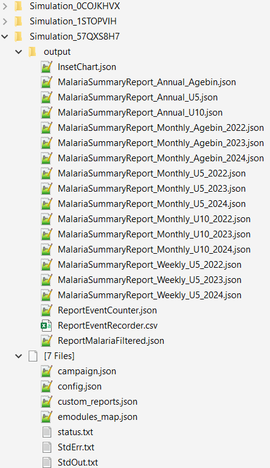   


Example of a summary report json file, MalariaSummaryReport_Annual_Agebin.json  
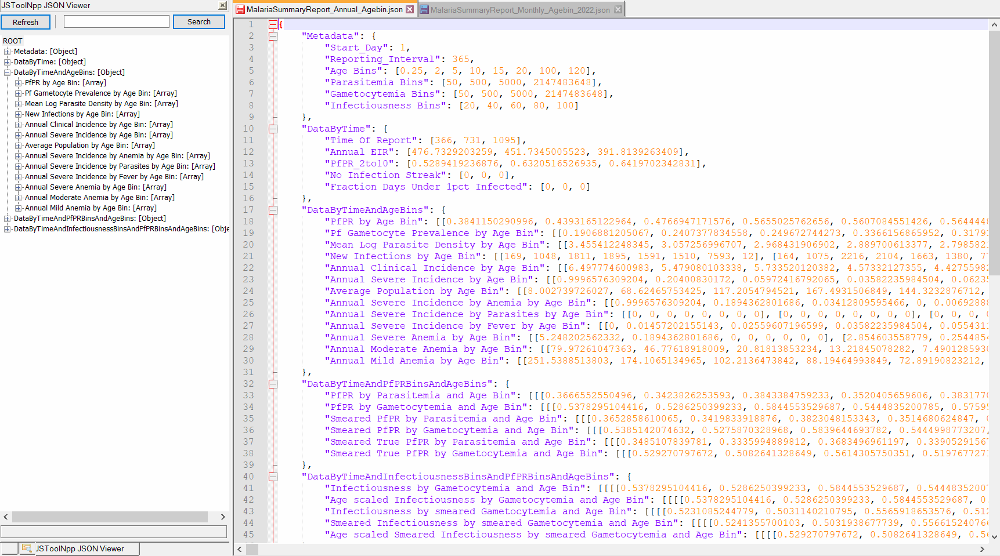   


Example of simulation results, after running analyzer (only csv files, see Part II for plots)
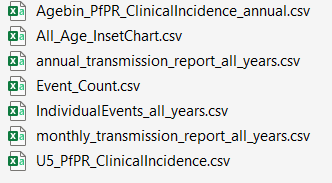    


View
suggested solution scripts for week 4 [simulation file](https://github.com/numalariamodeling/faculty-enrich-2022-examples/blob/main/Solution_scripts/run_exampleSim_w4.py)
, and [edited analyzer file](https://github.com/numalariamodeling/faculty-enrich-2022-examples/blob/main/Solution_scripts/analyze_exampleSim_w4_edited.py).


</p>
</details>

</p>
</details>


#### PART II - Plotting  

<details><summary><span>Click here to expand</span></summary>
<p>

- Run plotting scripts either using Python or R:
    - _Python_: `plot_exampleSim_w4.py`
    - _R_: `plot_exampleSim_w4.R`
- Look at the figures more critically, anything you would like to change? 
   - Given the interventions implemented does the curves look as expected?
- Open the plotting script of your choice (python or R) and adjust axis titles, colors or even add your own plot!
  - The plots generate an 'ugly' `unique_sweep` variable automatically to be generic and independent of number and name of sweep variables defined.
    However, the final output is difficult to interpret. These plots are good for diagnostic and yourself, but not for presenting to others. 
    In the script you can pass on a `scen_channel` variable which is used to color the lines, try it out for a single intervention coverage variable.
  - Note that all other columns that are not specifed in scen_channels (except date and outcome variables) will automatically be averaged using the mean. If you do not want this behaviour you need to adjust the plotting script.
- look at  `plot_Agebin_PfPR_ClinicalIncidence`, which aggregated all years to plot agebins at the x-axis, and has several panels of seletced channels.
  - when calling the function specify 1 channel of choice i.e. `plot_Agebin_PfPR_ClinicalIncidence(sim_dir, channels= 'Cases')`
    - a) modify the figure to have years as panels (facets) instead of channel (requires annual summary report csv)
    - b) modify the figure to have agebin as panels (facets) and years on the x-axis (annual or monthly summary report csv)
    - c) modify the figure to have agebin as color and unique_scen as panels, with years as x axis (annual or monthly summary report csv)
  - Note in python you will need to modify `for ai, channel in enumerate(channels):` as well as ` axes = [fig.add_subplot(2, 2, x + 1) for x in range(4)]`; and in R `facet_wrap(~name, scales = 'free')`


<details><summary><span>Check results</span></summary>
<p>

Default example Agebin_PfPR_ClinicalIncidence figure generated in Python  
  

Default example Agebin_PfPR_ClinicalIncidence figure generated in R  
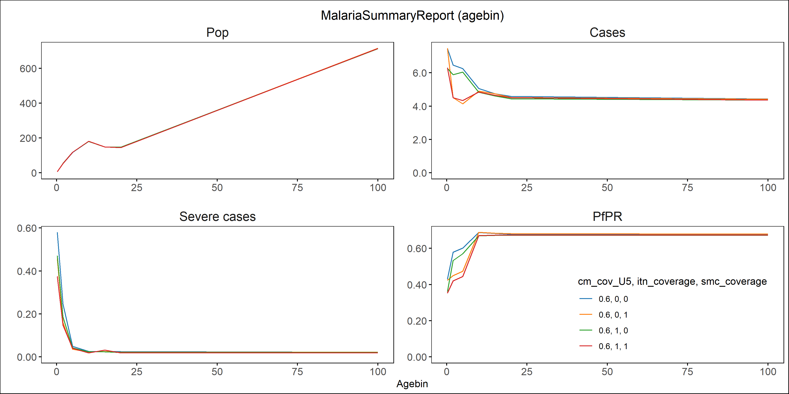  

Default example All_Age_Monthly_Cases figure generated in Python  
  

Default example All_Age_Monthly_Cases figure generated in R  
  


Default example TransmissionReport_monthly figure generated in Python  
  

Default example All_Age_Monthly_Cases figure generated in R  
  

Default example Received_Campaigns figure generated in Python  
  
_Note: in this example simulation only case management and SMC were included, no IRS and no vaccine_

Default example All_Age_Monthly_Cases figure generated in R
  
_Note: in this example simulation only case management and SMC were included, no IRS and no vaccine_

</p>
</details>

</p>
</details>

### Week 5: no technical curriculum <a name="week5"></a>

## Week 6: Serialization <a name="week6"></a>

[Lesson Week 6](https://faculty-enrich-2022.netlify.app/lessons/week-6/)

EMOD How To's:

- [Serialization](https://faculty-enrich-2022.netlify.app/modules/emod-how-to/emod-how-to/#serialization)

### Instructions


**Part 1: Set-Up Serialization & Run Burn-in**

<details><summary><span>Click here to expand</span></summary>
<p>

- Change the value of `SetupParser.default_block` from 'LOCAL' to **'HPC'**
    - This is to run the longer simulation on COMPS, as opposed to your local machine
- Add a variable 'serialize_year' to the run_exampleSim.py script (without any interventions), and set it equal to 50.
- Update the configuration parameters as shown below to enable serialization
- Run simulation
- Copy the experimentID ('expID') from the simulation metadata to pick-up from later.
    
</p></details>

    
**Part 2: Pick-up & run simulations from burn-in** 

<details><summary><span>Click here to expand</span></summary>
<p>

- Add a variable 'pull_year' and set it equal to 50
- Add a variable 'burnin_id' and set it equal to the experimentID copied from Part 1.
- Update configuration parameters to pick-up from the end of your burn-in simulation
- Import retreive_experiment from dtk-tools
- Use retreive_experiment to load the burn-in and group by tags
- Pick-up the simulations and run for 2 years with some intervention, and at least 10 random seeds

<details><summary><span>Check results</span></summary>
<p>

[To do: add image]
<!---->

</p>
</details>

</p>
</details>

## Week 7: Sweeping and calibration <a name="week7"></a>

[Lesson Week 7](https://faculty-enrich-2022.netlify.app/lessons/week-7/)

EMOD How To's:

- Sweeping and calibration
- [TODO]

### Instructions

<details><summary><span>Click here to expand</span></summary>
<p>

- [TODO]

<details><summary><span>Check results</span></summary>
<p>

[To do: add image]
<!---->

</p>
</details>

</p>
</details>

## Week 8: Individual properties

[Lesson Week 8](https://faculty-enrich-2022.netlify.app/lessons/week-8/)

EMOD How To's:

- Individual properties
- [TODO]

### Instructions

<details><summary><span>Click here to expand</span></summary>
<p>

- [TODO]

<details><summary><span>Check results</span></summary>
<p>

[To do: add image]
<!---->

</p>
</details>

</p>
</details>

## Week 9: Infusing simulations with real data <a name="week9"></a>

[Lesson Week 9](https://faculty-enrich-2022.netlify.app/lessons/week-9/)

EMOD How To's:

- [TODO]

### Instructions

<details><summary><span>Click here to expand</span></summary>
<p>

- [TODO]

<details><summary><span>Check results</span></summary>
<p>

[To do: add image]
<!---->

</p>
</details>

</p>
</details>

### Week 10: no technical curriculum <a name="week10"></a>

## Week 11: Advanced EMOD: HBHI workflow as a complex example <a name="week11"></a>

[Lesson Week 11](https://faculty-enrich-2022.netlify.app/lessons/week-11/)

EMOD How To's:

- [TODO]

### Instructions

<details><summary><span>Click here to expand</span></summary>
<p>

- [TODO]

<details><summary><span>Check results</span></summary>
<p>

[To do: add image]
<!---->

</p>
</details>

</p>
</details>

## Week 12: Advanced EMOD: Spatial modeling in EMOD <a name="week12"></a>

[Lesson Week 12](https://faculty-enrich-2022.netlify.app/lessons/week-12/)

EMOD How To's:

- [TODO]

### Instructions

<details><summary><span>Click here to expand</span></summary>
<p>

- [TODO]

<details><summary><span>Check results</span></summary>
<p>

[To do: add image]
<!---->

</p>
</details>

</p>
</details>

## Week 13: Advanced EMOD: gene drive and reactive interventions <a name="week13"></a>

[Lesson Week 13](https://faculty-enrich-2022.netlify.app/lessons/week-13/)

EMOD How To's:

- [TODO]

### Instructions

<details><summary><span>Click here to expand</span></summary>
<p>

- [TODO]

<details><summary><span>Check results</span></summary>
<p>

[To do: add image]
<!---->

</p>
</details>

</p>
</details>

## Week 14: HPC <a name="week14"></a>

[Lesson Week 14](https://faculty-enrich-2022.netlify.app/lessons/week-14/)

EMOD How To's:

- [TODO]

### Instructions

<details><summary><span>Click here to expand</span></summary>
<p>

- [TODO]

<details><summary><span>Check results</span></summary>
<p>

[To do: add image]
<!---->

</p>
</details>

</p>
</details>


</br>
</br>

### Congratulations!

#### You reached the end of the example lessons.


